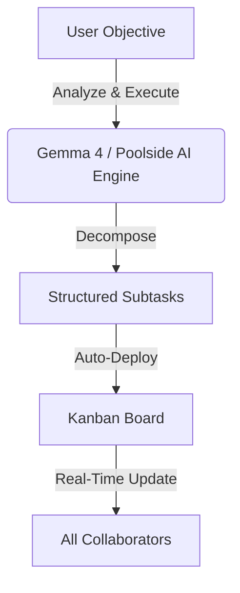

# TaskForge ⚡

[](https://github.com/RahulAdyaa/taskforge)
[](https://vercel.com)
[](https://mongodb.com)
[](https://openrouter.ai)
[](https://nodejs.org)
[](https://opensource.org/licenses/MIT)

> **AI-Powered Precision Task Engine** — A cinematic, high-performance project management platform with real-time sync, secure session management, and instant task decomposition powered by OpenRouter.

---

## 🎯 What It Does

TaskForge fuses a sleek, command-room brutalist interface with intelligent AI automation. Type any objective into the **Analyze & Execute** engine, and watch the AI break it down into structured, prioritized tasks—instantly deployed onto your Kanban board.



### Key Capabilities

*   🤖 **AI Task Decomposition**: Breaks complex goals down into 3-15 prioritized subtasks.
*   ⚡ **Real-Time Workspace**: Live updates for Kanban task dragging, comments, and timers using WebSocket (Socket.IO).
*   ⏱ **Active Presence & Timers**: Pulse indicators showing online teammates and active counters. Project admins see live member timers on their dashboard instantly.
*   📋 **AI Daily Standups**: Analyzes your last 24 hours of cross-workspace operations (completions, pending tasks, blockers) and generates reports with clickable task routes.
*   💬 **Task-Level Discussion Threads**: Collaborative markdown chat inside each task, featuring real-time typing indicators, comments editing, deletion, and hover metadata audits.
*   🔍 **Command Palette (Cmd+K / Ctrl+K)**: Instant global search, navigation, and theme toggling.
*   🛡️ **Hardened Auth**: Google OAuth 2.0, secure JWT session keys, Refresh Token Rotation (RTR), and Two-Factor Authentication (2FA) with TOTP QR codes.
*   🌓 **Dynamic Theme System**: Sleek glassmorphic layouts with reactive light/dark theme adaptation (down to custom dark-mode styled Google buttons).

---

## 🛠 Tech Stack

| Tier | Technologies Used |
| :--- | :--- |
| **Frontend** | React 19, Vite, Tailwind CSS v3, GSAP (cinematic animations), Zustand (state), TanStack Query, `@dnd-kit` (Kanban drag-and-drop), Recharts |
| **Backend** | Express.js, Socket.IO (WebSockets), Mongoose, MongoDB Atlas |
| **Security & Auth** | Google OAuth 2.0, bcrypt, JSON Web Tokens (JWT), Speakeasy + qrcode (2FA / TOTP) |
| **AI Core** | OpenRouter (Primary: `poolside/laguna-xs.2:free`, Secondary: `google/gemma-4-31b-it:free`) |
| **Infrastructure** | Vercel (Deployment), MongoDB Atlas (Cloud database) |

---

## 🚀 Local Setup

### Prerequisites
- Node.js 20+
- A free [MongoDB Atlas](https://www.mongodb.com/atlas) cluster (M0 tier)
- OpenRouter API key

### 1. Clone the repository
```bash
git clone https://github.com/RahulAdyaa/taskforge.git
cd taskforge
```

### 2. Install dependencies
```bash
npm install
```

### 3. Setup environment files

**Backend** — copy and fill in `apps/api/.env`:
```bash
cp apps/api/.env.example apps/api/.env
```
```env
MONGODB_URI="mongodb+srv://<username>:<password>@<cluster>.mongodb.net/taskforge?retryWrites=true&w=majority"
JWT_SECRET="generate-with: node -e \"console.log(require('crypto').randomBytes(64).toString('hex'))\""
JWT_REFRESH_SECRET="another-strong-random-secret"
PORT=3001
FRONTEND_URL="http://localhost:5173"
GOOGLE_CLIENT_ID="your-google-oauth-client-id"
GOOGLE_CLIENT_SECRET="your-google-oauth-client-secret"
OPENROUTER_API_KEY="your-openrouter-api-key"
```

**Frontend** — copy and fill in `apps/web/.env`:
```bash
cp apps/web/.env.example apps/web/.env
```
```env
VITE_GOOGLE_CLIENT_ID="your-google-oauth-client-id"
```

### 4. Run development servers
```bash
npm run dev
```
*   **Frontend**: `http://localhost:5173`
*   **API Server**: `http://localhost:3001`

---

## 📁 Project Structure

```
taskforge/
├── api/                        # Vercel serverless entry point
│   └── index.js
├── apps/
│   ├── api/                    # Express.js backend API
│   │   ├── src/
│   │   │   ├── index.js        # Server entry point
│   │   │   ├── lib/
│   │   │   │   ├── jwt.js      # Token signing and session generation
│   │   │   │   └── database.js # Database client initialization
│   │   │   ├── middleware/     # Auth, Zod validation, role guards
│   │   │   ├── models/         # Mongoose DB Schemas
│   │   │   └── routes/         # REST API Route Handlers
│   │   └── .env.example
│   └── web/                    # React frontend application
│       ├── src/
│       │   ├── components/     # UI, Kanban Board, Chat Widget, Time Tracker
│       │   ├── pages/          # Authentication & Workspace views
│       │   ├── store/          # Zustand global states (auth, theme)
│       │   └── lib/            # Axios API client
│       └── .env.example
├── scratch/                    # Local dev scripts and DB utilities (ignored in production)
├── vercel.json                 # Monorepo deployment mappings
├── package.json                # Workspace configuration
└── README.md
```

---

## 🔐 Advanced Security Implementations

*   **Session Revocation**: JWT generation encodes unique `sessionId` values in both Access and Refresh tokens. The backend [authenticate.js](file:///Users/rahuladya/Documents/taskforge/apps/api/src/middleware/authenticate.js) middleware validates this ID against the user's active session logs in MongoDB on every request, allowing immediate global session termination and revoking compromised tokens on logout.
*   **Refresh Token Rotation (RTR)**: The token endpoint rotates refresh tokens on every refresh request, invalidating old families to prevent replay attacks.
*   **Two-Factor Authentication (speakeasy)**: Leverages Speakeasy for RFC 6238 TOTP tokens, enabling 2FA setups via QR codes with standard authenticator apps (Google Authenticator, Authy, etc.).

---

## 📄 License

MIT © 2026 TaskForge
